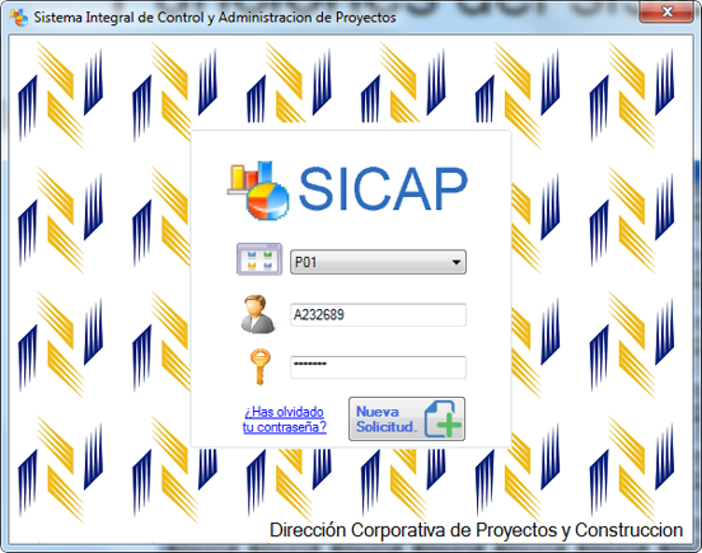
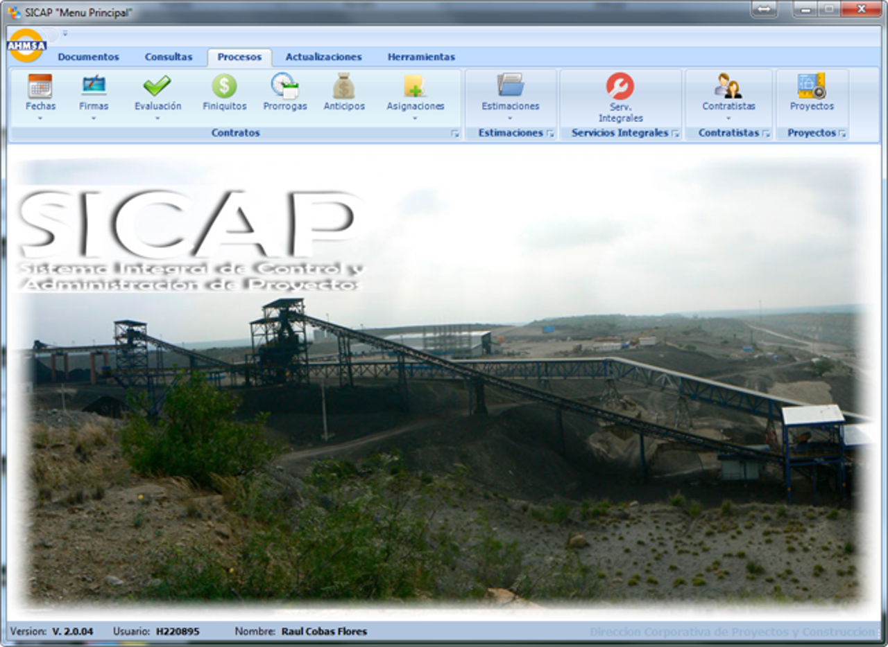
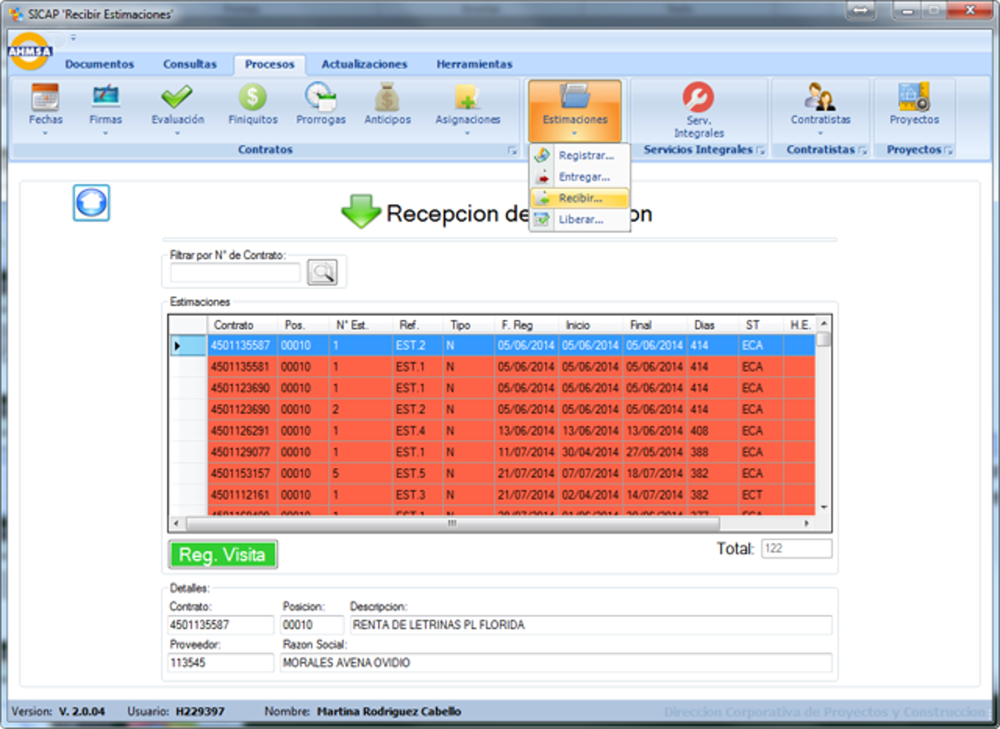
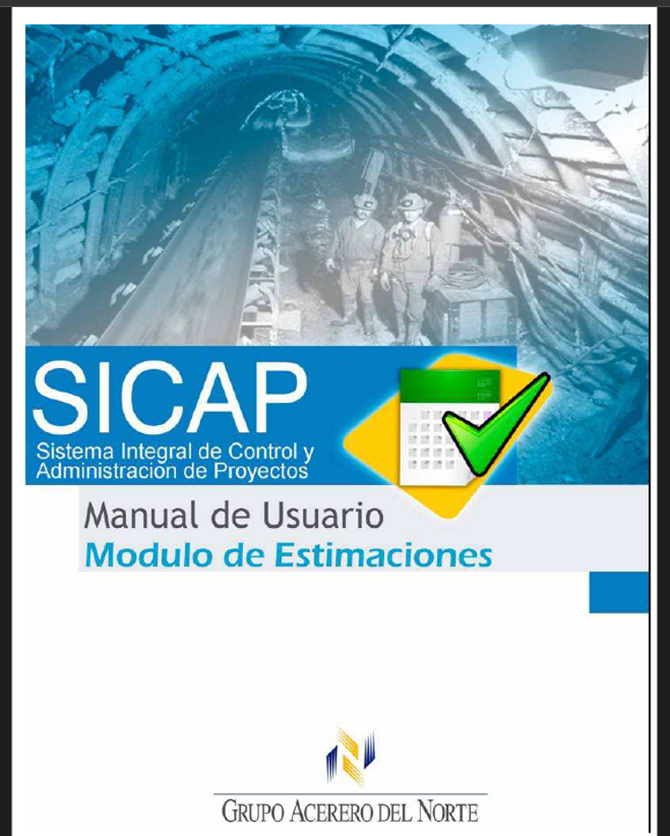

# 📦 SICAP

## 🧭 Overview
**SICAP** is a comprehensive Windows-based enterprise application developed using **C#** and **SQL Server**, hosted on internal company Windows Servers. Originally created to modernize a legacy Visual FoxPro application, it supports project estimation, contract tracking, assignment workflows, and KPIs for multiple engineering departments at AHMSA.  
It serves as a core system for project managers, directors, and engineers, supporting administrative, technical, and field workflows with role-based access control.

## 💡 Idea & Concept
The system replaced an outdated manual and legacy solution with a fully integrated software product. Inspired by the need for scalable workflow automation, SICAP was designed to:
- Import and categorize data from SAP (via TXT files)
- Automate contract lifecycle workflows
- Provide visual and dynamic contract performance insights
- Enforce secure authentication and session control
- Enable continuous data sharing across internal tools like **[SICAP Indicators](#https://github.com/HermiloOrtega/SICAP-Indicators)**, **[SICAP Web](#https://github.com/HermiloOrtega/SICAP-Web)**, **[SICAP Updater](#https://github.com/HermiloOrtega/SICAP-Web-Updates)**, **[SICAP Foliador](#https://github.com/HermiloOrtega/SICAP-Folio-Manager)**

### Login Screen

### Home page

### Collect estimation

### Manual cover

## ✨ Features & Functionality
- 🔐 Encrypted login, session tracking, auto sign-out, and environment selector (DEV/QAS/PRD)
- 📊 KPI dashboards and dynamic tables with contract status & SLA alerts
- 🔄 SAP TXT import to SQL Server with business rule processing
- 📥 Contract assignment via internal inbox module
- 🧾 Estimation and payment processing with auto-numbering and audit trail
- 📧 Notifications per workflow event, using email and alert modals
- 🧩 Modular design with screen embedding and RibbonBar interface
- 🛠 Admin-only tools to:
  - Broadcast update messages to users
  - Disable modules in case of bugs
  - Track system version & access logs
- 📈 Usage tracking for every user interaction and module
- 🧾 Session log (start/end times, fallback time calculation if crash occurs)

## ⚙️ Tech Stack
- **Language:** C#
- **Framework:** .NET Framework (WinForms)
- **Database:** SQL Server
- **Reporting:** Crystal Reports
- **IDE:** Visual Studio
- **Other:** SAP integration (via TXT), Windows Scheduled Tasks

## 🏗 Architecture & Design
- Monolithic Windows desktop application
- Ribbon-style navigation with embedded screens
- Role-based permission system with secure access control
- Multi-environment deployment support (DEV, QAS, PRD)
- Shared database with SICAP Indicators, SICAP Web, and SICAP Foliador
- Hosted on AHMSA’s internal Windows Server infrastructure

## 🚀 Installation & Setup
- **Environments:** DEV, QAS, PRD
- **Prerequisites:** .NET Framework, SQL Server, access to SAP exports
- **Deployment:** Internal company servers
- **Startup:** Auto-start configuration and multiple-instance prevention

> **Note:** Only approved internal users can access the app with appropriate permissions.

## 🧑‍💻 Usage
1. Login with credentials and choose environment (DEV/QAS/PRD)
2. Access estimation, contract, or KPI modules from the RibbonBar
3. Use assignment workflows, inbox approvals, and status updates
4. View reports, download exports, or receive module alerts

## 🔍 My Role & Contributions
- 💼 Lead Full-Stack Developer & System Architect
- 🧱 Designed and implemented entire backend + frontend
- 🗂 Designed database schema, stored procedures, and SAP parsers
- 📩 Created notification framework, session tracking, error logging
- 🧪 QA tested and deployed across three environments
- 🤝 Managed feature requests, feedback loops, and design approvals with stakeholders

## 🧗 Challenges & Learnings
- Migrating legacy logic while avoiding data loss
- Handling thousands of rows from SAP with high performance
- Designing scalable workflows and adaptable UI behavior
- Creating a system-wide update and module lockdown process
- Logging detailed usage telemetry for feedback and auditing

## 📈 Future Enhancements
- Migrate parts of the system to web-based modules
- Replace Crystal Reports with modern web PDF reporting
- Integrate approval workflows with Outlook
- Add dashboard analytics and visual BI elements

## 🪪 License
⚠️ **Internal Use Only**  
Originally published under MIT; changed to **CC BY-NC-ND 4.0** as of April 22, 2025.

## 🔗 Related Projects
- **[SICAP Indicators](#https://github.com/HermiloOrtega/SICAP-Indicators)**
- **[SICAP Web](#https://github.com/HermiloOrtega/SICAP-Web)**
- **[SICAP Updater](#https://github.com/HermiloOrtega/SICAP-Web-Updates)**
- **[SICAP Foliador](#https://github.com/HermiloOrtega/SICAP-Folio-Manager)**